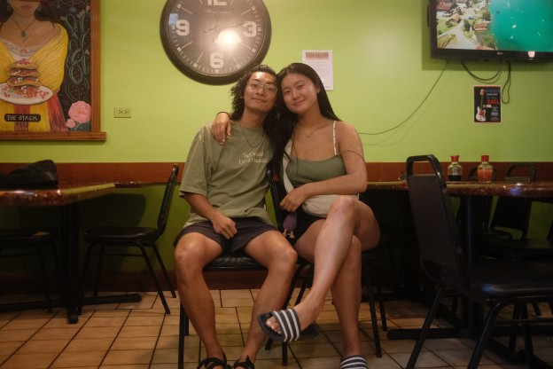
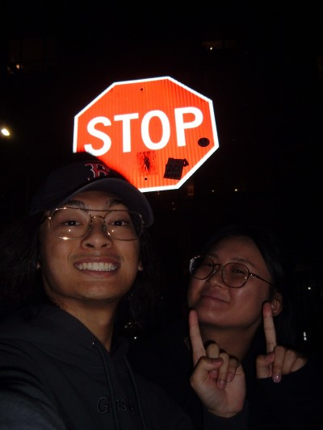

# HAPPY 1 YAD MY LOVE!!! 🦆🦆🦆🦆🦆
> **Aug 31, 2024  • Matt**
----

##### Dear Julia,

Today is __our__ day. The day that we decided to make things official and start our wonderful lives together. You are the most special and precious person to enter my life, and I don't regret a single moment in the millions of moments that I have spent with you in the past year

This essay is divided into 3 sections:
- What I love so much about you
- Our favorite memories together
- What I am excited for in the future

### What I love

> Intrusive thought!!!!! let's be best friends and to continue to make beautiful memories together (literally just a regular thought... )

When we first met, my first impression was that you were stunning. I was so shook, that I didn't even want to make eye contact with you. With a little bit of alcohol, I finally had the courage to ask you to dance all night (🤠). After the night ended, I couldn't stop thinking about you. That was when I knew I had to shoot my shot, and I am so glad I did.

Since then, we've gotten to know each other so well. When we first got to know each other, I thought it was so sexy that you were in touch with your emotions and not afraid to just dive in head first. From the start, you were really open and were willing to share your true self. Everything felt so safe and natural for us to share our feelings with eachother. I am so fortunate to have someone who is so emotionally intelligent and smart in my life (🤓).

You challenge me to always be better, and you really work hard to love me for me. You worked so hard spend time together, which really means a lot to me, and I am so glad that we were able to make things work in spite of the distance.

I always feared that we lose that beautiful spark, but that day never came. You are my person. When I am with you, I break out of my shy shell and I can be my bubbal-y self. THANK YOU THANK YOU THANK YOU. You made me grow as a person and I appreciate you so much for being the beautiful woman in my life that makes me complete. 

### Favorite Memories
> "If you jump I jump"
> 
>  \- some dude probably

My favorite memory together has to be when you came back to Hawaii to spend 2 more weeks together. It was a little crazy and spontaneous and definitely outside of your comfort zone. In some ways, it kind of felt like a crazy soul mate moment.

To me that trip is symbolic of the fact that we could do anything. We were doing this trip in spite of the odds, and we were making the most of life. We tried so many new placs in Oahu, and I made so many new memories. I've been to Oahu so many times, but that trip was so iconic. Just the right combination of fun, exhaustion, and relaxation

### The future

> “In a world of infinite choice if something is not made specifically for me I'm gone.”
― Ramit Sethi

This past year has shown me that we have a truly special relationship and chemistry with one another. Every day I feel like there is no place be or person I'd rather spend my time with. We get eachother's humor, and you are my best friend. In the next year, I want us to lock-in and DINK so freaking hard. With our combined net TC of 300k, we can try all the coolest freaking restaurants, and hopefully continue to go on awesome trips.

We challenge each other, and push each other to be the best we can possibly be. I love the way we communicate, and I think it's good that we get to finally settle in to New York **together**. Thank you for being their for me, and I am excited for us to plan more trips in the future. LETS GO UPSTATE AND DO SOME CAMPING OR SOME SHIT WOOOOHOOO

----

Love you so much,

Matt!